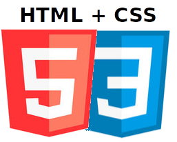
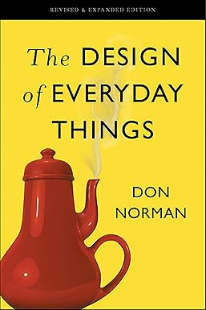

<!-- {"layout": "title"} -->
# Curso Introdutório de **HTML, CSS, JavaScript e Experiência do Usuário** 
## **Glívia Barbosa** e **Daniel Hasan**
---
# Quem somos? 

 <!-- {.portrait.push-left} -->
**Glivia Barbosa** - Doutora em Computação 
Especialista em projeto e avaliação de interfaces
centradas na experiencia do usuário

 <!-- {.portrait.push-right} -->
**Daniel Hasan** - Doutor em Computação 
Aprendizado de máquina 
+10 anos de experiência em desenvolvimento web
---
# De onde somos? 

  -  <!-- {li:style="display: inline-block; width:43%;border-right:1px dashed black; padding-right: 10px;"}--> 
      - Mais de 120 cursos em 10 campi em MG  

      Em BH:
        - 14 cursos Técnicos
        - 11 cursos de graduação
        - 11 cursos de mestrado
        - 7 cursos de doutorado
         

  - <!-- {li:style="display: inline-block; width:52%;"}--> 
    Cursos:
      - Eng. Computação
      - Tec. em Informática
      - Tec. em Redes
      - Pos Grad. em Modelagem Matemática e Computacional (mestrado e doutorado)
        

---
<!-- {"layout": "section-header" } -->
# Para onde vamos?
## Apresentação do curso

1. Aulas Síncronas e Assincronas
1. Carga horária: 38 horas
1. Avaliação on-line por módulo
1. Atividades práticas
1. 1 de novembro a 31 de janeiro
<!-- {ol:.content} -->

---
<!-- {"layout": "section-header" } -->
# Aula Inaugural
## [Web e as Ovelhas 🐑 ](classes/intro) 

---
<!-- {"layout": "section-header"} -->
# Plano de Ensino

## Sumário do conteúdo

[Módulos](#modulos)
  ~ Módulos do curso

[Trabalhos](#tps)
  ~ Trabalho de alunos

[Bibliografia](#bibliografia)
  ~ Livros e materiais básicos e complementares

[Mais...](#info)
  ~ Pré requisito para o certificado
  ~ Pagamentos e condições

<!-- {dl:.content} -->

---
<!-- { "hash": "modulos", "layout": "circling-balloons" } -->
## Módulos

- 
  Conceitos básicos, layout e responsividade, elemento de dados e interação

- 
Qualidades de uso, design de interface e interação, avaliação  de interfaces Web,  Métodos e Ferramentas apoio

- 
  Captura de eventos, criação dinâmica de elementos, APIs e aplicações: criação de extensões Chrome e Google Apps Script

---
<!-- {"hash": "tps","layout": "centered-horizontal"} -->
### Trabalhos dos alunos de Informática/Redes do CEFET-MG

::: gallery .fish-eye
- 
- 
- <a href="https://marcosazevedo2112.github.io/NeedForSpace/"><video src="https://fegemo.github.io/cefet-front-end-large-assets/videos/need-for-space.mp4" autoplay muted loop="0" poster="images/trabalhos/2020/need-for-space.webp"></video></a>
- 
- 
- 
- <a href="https://arthurg12.github.io/trabalho/"><video src="https://fegemo.github.io/cefet-front-end-large-assets/videos/weboretum.mp4" autoplay muted loop="0" poster="images/trabalhos/2020/weboretum.webp"></video></a>
- 
- 
:::
<!--
---
<!-- {"hash": "slides"} 
# Aulas <!--<small>(1/3)</small>

[🐑 Intro](classes/intro)  <!-- {dl:.width-20.full-width}
~ Introdução à Programação Web e as Ovelhas

[🦖 HTML1](classes/html1/)
~ Plantas Carnívoras, Ingredientes do HTML (_tags_) e Temperando com CSS

[🏯 HTML2](classes/html2/)
~ Coding Dojo, Mais _tags_ HTML e Entendendo regras CSS

[👑 HTML3](classes/html3/)
~ Tabelas, Tesouros e Piratas

[🐝 CSS1](classes/css1/)
~ Seletores de classe, Flutuação e Abelhas 

[🥷 CSS2](classes/css2/)
~ História, a Cascata e outros Seletores, Ferramentas e Ninjas 

[🗒️ HTML4](classes/html4/)
~ Div/Span, Box Model, Float e Desafios 

[🦄 CSS3](classes/css3/)
~ Fontes, Multimídia e Unicórnios 

----->
<!-- { "hash": "ementa", "layout": "section-header" } -->
# Ementa

## Objetivos

1. **Criar páginas web** _estáticas_ com HTML, CSS e JavaScript
1. Criar páginas seguindo **requisitos de *layout*** diversos
1. Entender os principios básicos da **Experiencia do Usuário (UX)**
1. Criar **páginas web interativas** usando JavaScript
1. **Integrar páginas** web estáticas com servidores **via AJAX**
<!-- {ol:.content} -->

---
<!-- { "hash": "bibliografia","layout": "centered", "styles": ["styles/classes/books.min.css"] } -->
## **Livro texto** sobre HTML e CSS

::: figure .book
-  <!-- {.full-width.full-height} -->
- .
<!-- {ul:.hardcover_front} -->
- .
- [Sobre](http://www.altabooks.com.br/use-a-cabeca-html-e-css.html) <!-- {a:.book-btn target="_blank"} -->
- .
- .
- .
<!-- {ul:.page} -->
- .
- .
<!-- {ul:.hardcover_back} -->
- .
- .
<!-- {ul:.book_spine} -->
:::

**Título**
	 ~ Use a Cabeça HTML e CSS, 2ª edição (traduzida)

**Autores**
	 ~ Elisabeth Robson, Eric Freeman

**Editora**
   ~ O'Reilly Media, 2015 (tradução)

---
<!-- { "layout": "centered", "styles": ["styles/classes/books.min.css"] } -->
## **Livro texto** sobre Experiência do Usuário

::: figure .book
-  <!-- {.full-width.full-height} -->
- .
<!-- {ul:.hardcover_front} -->
- .
- [Sobre](http://www.altabooks.com.br/use-a-cabeca-html-e-css.html) <!-- {a:.book-btn target="_blank"} -->
- .
- .
- .
<!-- {ul:.page} -->
- .
- .
<!-- {ul:.hardcover_back} -->
- .
- .
<!-- {ul:.book_spine} -->
:::

**Título**
	 ~ The Design Of Everyday Things

**Autores**
	 ~  Don Norman

**Editora**
   ~  Basic Books, 2013

---
<!-- { "layout": "centered", "styles": ["styles/classes/books.min.css"] } -->
## **Livro texto** sobre Experiência do Usuário

::: figure .book
-  <!-- {.full-width.full-height} -->
- .
<!-- {ul:.hardcover_front} -->
- .
- [Sobre](https://leanpub.com/ihc-ux) <!-- {a:.book-btn target="_blank"} -->
- .
- .
- .
<!-- {ul:.page} -->
- .
- .
<!-- {ul:.hardcover_back} -->
- .
- .
<!-- {ul:.book_spine} -->
:::

**Título**
	 ~ Interação Humano-Computador e Experiência do Usuário

**Autores**
	 ~  Simone Barbosa, Bruno Santana da Silva, Milene Silveira, Isabela Gasparini, Ticianne Darin, and Gabriel Barbosa

**Editora**
   ~  Basic Books, 2021

---
<!-- {"layout": "centered"} -->
## **Livro texto** sobre JavaScript

::: figure .book
-  <!-- {.full-width.full-height} -->
- .
<!-- {ul:.hardcover_front} -->
- .
- [Ler gratui- tamente](http://eloquentjavascript.net/) <!-- {a:.book-btn target="_blank"} -->
- .
- .
- .
<!-- {ul:.page} -->
- .
- .
<!-- {ul:.hardcover_back} -->
- .
- .
<!-- {ul:.book_spine} -->
:::

**Título**
  ~ Eloquent JavaScript _3rd edition_

**Autor**
  ~ Marijn Haverbeke

**Editora**
  ~ No Starch Press

---
<!-- {"layout": "centered"} -->
## **Livro texto** sobre APIs do HTML5

::: figure .book
-  <!-- {.full-width.full-height} -->
- .
<!-- {ul:.hardcover_front} -->
- .
- [Sobre](http://www.altabooks.com.br/use-a-cabeca-programacao-em-html5.html) <!-- {a:.book-btn target="_blank"} -->
- .
- .
- .
<!-- {ul:.page} -->
- .
- .
<!-- {ul:.hardcover_back} -->
- .
- .
<!-- {ul:.book_spine} -->
:::

**Título**
  ~ Use a Cabeça: Programação em HTML5, 1ª edição

**Autor**
  ~ Eric Freeman

**Editora**
  ~ O'Reilly Media, 2014 (tradução)

---
<!-- {"layout": "centered", "state": "emphatic"} -->
# Bibliografia Complementar

---
<!-- {"layout": "centered"} -->
## Mergulhe no HTML5

  
  

- [Online](http://diveintohtml5.com.br/), gratuito

---
<!-- {"layout": "centered"} -->
## JavaScript: The Good Parts

  
  

- **Título**	JavaScript, the Good Parts, First Edition
- **Autor**	Douglas Crockford
- **Editora** O'Reilly Media, 2008
---
<!-- {"hash": "info"} -->
# Pré-requisitos para o certificado

1. Obter 60% de aproveitamento no total das avaliações (Práticas+teóricas)
1. Realizar o pagamento do curso (prérequisito para acessar cada módulo)
1. Terminar o módulo no prazo. O aluno poderá repetir o módulo gratuitamente, tendo novas ofertas do mesmo (iremos corrigir isso no edital). 

<!-- {ol:.content} -->
---

# Pagamentos e condições
- R$ 460,00 ou 3 x R$ 180,00<!-- {ul:.bulleted} -->
- **Primeiro lote:** R$ 320,00 à vista. Inscrição até 02/10 pagamento até 07/10.
  - Caso não seja pago no prazo (até 07/10/2024), perderá a promoção
- À vista:
  - Pagamento antes do curso
  - O pagamento é prerequisito para acesso ao curso
- Parcelado
  - Pagamento antes de cada módulo
  - O pagamento é prerequisito para acesso ao módulo
  - O aluno poderá perder o direito de acessar o módulo caso não pague a tempo